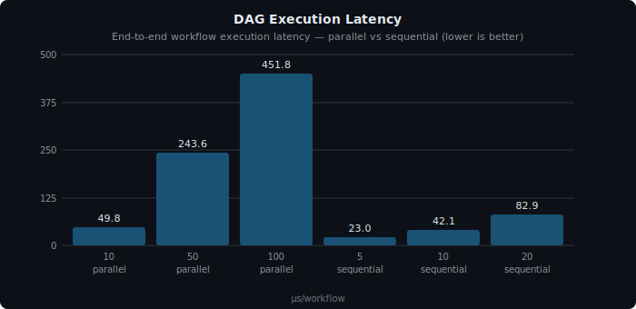
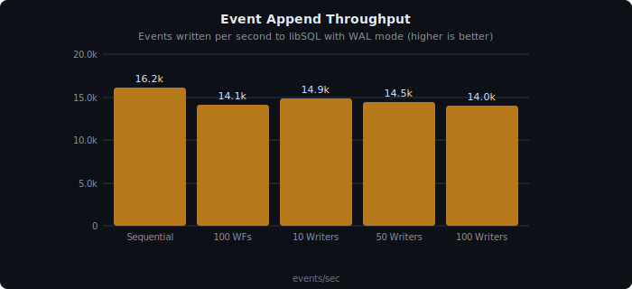
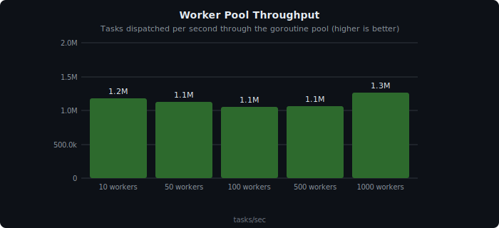
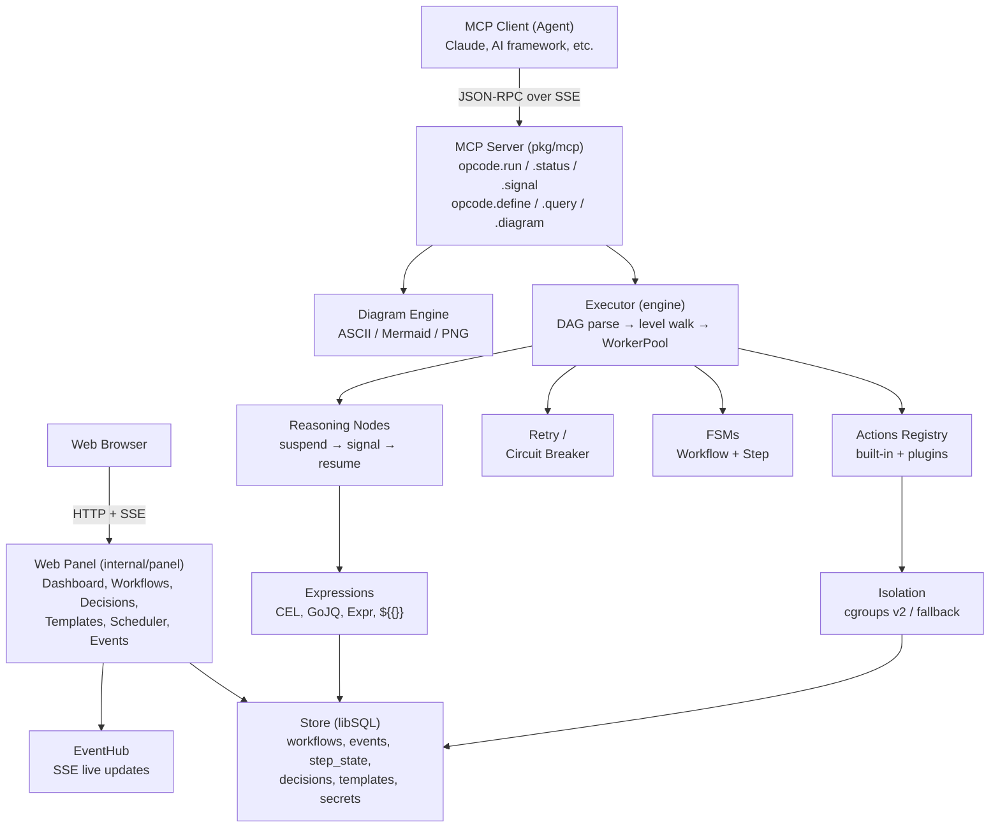
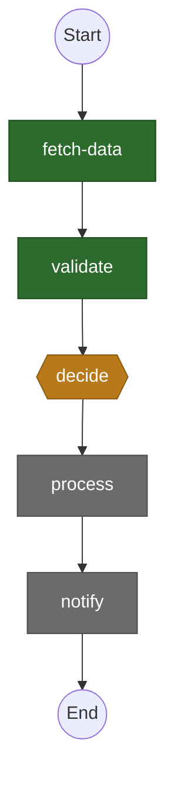

<div align="center">
  

<picture>
    <source media="(prefers-color-scheme: dark)" srcset="assets/banner-dark.svg">
    
  </picture>

<p align="center">
  <a href="https://go.dev"></a>
  <a href="https://pkg.go.dev/github.com/rendis/opcode"></a>
  <a href="LICENSE"></a>
  <a href="https://goreportcard.com/report/github.com/rendis/opcode"></a>
  <a href="https://github.com/rendis/opcode/releases"></a>
  <a href="https://github.com/rendis/opcode/commits/main"></a>
  <a href="https://github.com/rendis/opcode"></a>
  <a href="https://github.com/rendis/opcode/graphs/contributors"></a>
  <a href="#agent-skill"></a>
  <a href="https://deepwiki.com/rendis/opcode"></a>
</p>

</div>

LLM agents burn tokens on repetitive tasks. Every API chain, every data pipeline, every approval flow — re-reasoned from scratch, every time.

OPCODE is the execution layer agents are missing. Define a workflow once, execute it forever — zero tokens, zero re-reasoning, deterministic every run. Persistent across sessions, schedulable without invocation, coordinating N agents through 6 MCP tools over SSE. Workflows are expressed as directed acyclic graphs (DAGs) with built-in support for reasoning nodes, flow control, event sourcing, process isolation, and secret management.

## Why OPCODE?

| Without OPCODE                        | With OPCODE                         |
| ------------------------------------- | ----------------------------------- |
| Agent re-reasons every repeated flow  | Reason once, template, execute free |
| Workflows die with the context window | Persist across sessions and crashes |
| Can't self-trigger at scheduled times | Cron scheduler runs autonomously    |
| Each run costs inference tokens       | Each run costs zero tokens          |
| Output varies between identical runs  | Deterministic, identical every time |
| One agent, one thread                 | N agents on shared workflows        |

## Key Features

- **MCP-native interface** -- 6 tools (`opcode.run`, `opcode.status`, `opcode.signal`, `opcode.define`, `opcode.query`, `opcode.diagram`) over SSE — agents call one tool and the workflow executes without further inference
- **DAG-based execution** -- Automatic parallelism, level-by-level dispatch; a 10-step workflow completes in ~50µs with zero tokens spent
- **Reasoning nodes** -- Human-in-the-loop / agent-in-the-loop decision points that suspend workflows and resume on signal; decisions are stored once and never re-reasoned
- **Event sourcing** -- Append-only event log with materialized step states; workflows survive crashes and resume exactly where they left off
- **Flow control & expressions** -- Conditions (CEL), loops, parallel branches, wait steps, GoJQ transforms, Expr logic, `${{...}}` interpolation — complex logic without inference cost
- **Workflow diagrams** -- Visual DAG in ASCII (CLI), Mermaid (markdown), or PNG (graphviz) with runtime status overlay
- **Web management panel** -- Built-in dashboard for multi-agent monitoring, decision resolution, and workflow management
- **Process isolation** -- Linux cgroups v2 (memory, CPU, PID namespace) with macOS fallback — safe execution of shell commands with resource limits
- **Secret vault** -- AES-256-GCM encrypted secrets with PBKDF2 key derivation; resolved at runtime via `${{secrets.KEY}}` without exposing secrets in workflow definitions
- **Plugins, scheduling & resilience** -- Cron scheduler runs workflows autonomously (no agent invocation needed), MCP subprocess plugins with auto-restart, per-action circuit breakers

## Table of Contents

- [Why OPCODE?](#why-opcode)
- [Performance](#performance)
- [Quick Start](#quick-start)
- [Agent Skill](#agent-skill)
- [Tech Stack](#tech-stack)
- [Examples](#examples)
- [Architecture](#architecture)
- [MCP Tools](#mcp-tools)
- [Workflow Diagrams](#workflow-diagrams)
- [Web Panel](#web-panel)
- [Workflow Basics](#workflow-basics)
- [Environment Variables](#environment-variables)
- [Testing](#testing)
- [Deployment](#deployment)
- [Troubleshooting](#troubleshooting)

## Performance

Auto-generated by `make benchmarks` (`go run ./cmd/gen-benchmarks`). See [`docs/benchmarks.md`](docs/benchmarks.md) for full results, methodology, and per-scenario breakdowns.

> ↓ = lower is better · ↑ = higher is better

### DAG Execution

Full workflow execution: DAG parse, level walk, WorkerPool dispatch, FSM transitions, event emission.

<div align="center">
  
</div>

| Scenario            | Latency ↓ | Throughput ↑ |
| ------------------- | --------: | -----------: |
| 10 parallel steps   |     ~47µs |  ~21k wf/sec |
| 100 parallel steps  |    ~449µs | ~2.2k wf/sec |
| 500 parallel steps  |    ~2.4ms |  ~422 wf/sec |
| 5 sequential steps  |     ~24µs |  ~42k wf/sec |
| 50 sequential steps |    ~200µs |   ~5k wf/sec |

> A 10-step workflow completes in ~50µs. Even 500 parallel steps finish in ~2.4ms. Latency scales linearly — the engine adds ~4µs overhead per step regardless of execution mode.

### Event Store (libSQL)

<div align="center">
  
</div>

| Operation            | Latency ↓ |      Throughput ↑ |
| -------------------- | --------: | ----------------: |
| Append (sequential)  |     ~64µs | ~15.6k events/sec |
| Append (100 writers) |     ~73µs | ~13.7k events/sec |
| Replay 1,000 events  |    ~6.4ms |                 — |

> ~15k event appends/sec with <12% drop under 100 concurrent writers. Each step emits 2-3 events, supporting ~5k-7k step completions/sec. Crash recovery replays 1,000 events in ~6.4ms.

### Worker Pool

<div align="center">
  
</div>

All pool sizes (10-1000 workers) exceed 1M tasks/sec. Pool overhead is ~0.85µs per task — size barely affects CPU-bound throughput.

## Quick Start

> **Prerequisites:** Go 1.25+, CGO enabled, GCC / C compiler (Xcode CLI Tools on macOS, `gcc libc6-dev` on Linux).

### 1. Clone & Build

```bash
git clone https://github.com/rendis/opcode.git
go build -C /path/to/opcode -o opcode ./cmd/opcode/
```

### 2. Run the Server

```bash
opcode install --listen-addr :4100 --vault-key "my-secret-passphrase"
```

This writes `~/.opcode/settings.json`, downloads [`mermaid-ascii`](https://github.com/AlexanderGrooff/mermaid-ascii) for enhanced ASCII diagrams, and starts the daemon. The web panel is available at `http://localhost:4100`.

If the process stops, restart with:

```bash
OPCODE_VAULT_KEY="my-secret-passphrase" opcode
```

> For production, set `OPCODE_VAULT_KEY` as an env var in your process manager (systemd, launchd). The `install` step is only needed once.

### 3. Configure as an MCP Server

Add opcode to your MCP client configuration (`.mcp.json`):

```json
{
  "mcpServers": {
    "opcode": {
      "type": "sse",
      "url": "http://localhost:4100/sse"
    }
  }
}
```

### 4. Verify (optional)

```bash
go test -C /path/to/opcode ./... -count=1 -timeout 60s
```

All 981 tests should pass. For CLI-based tool testing, see [Connecting via mcporter](docs/mcp-tools.md#connecting-via-mcporter).

## Agent Skill

OPCODE includes an agent skill that teaches AI coding agents (Claude Code, Cursor, etc.) how to define, execute, and manage workflows using the MCP tools. The skill provides reference documentation for workflow schemas, actions, expressions, error handling, and common patterns.

### Install via [skills.sh](https://skills.sh)

```bash
npx skills add https://github.com/rendis/opcode --skill opcode
```

### Install via [ClawHub](https://clawhub.ai)

```bash
npx clawhub@latest install opcode
# or
pnpm dlx clawhub@latest install opcode
# or
bunx clawhub@latest install opcode
```

## Tech Stack

| Component              | Technology                                                                           |
| ---------------------- | ------------------------------------------------------------------------------------ |
| **Language**           | Go 1.25+                                                                             |
| **Database**           | Embedded libSQL (via `go-libsql`, CGO required)                                      |
| **MCP Server**         | `mcp-go` (SSE transport)                                                             |
| **Expression Engines** | CEL (`cel-go`), GoJQ (`gojq`), Expr (`expr-lang/expr`)                               |
| **Validation**         | JSON Schema Draft 2020-12 (`santhosh-tekuri/jsonschema/v6`)                          |
| **Diagrams**           | `goccy/go-graphviz` (WASM-based, no CGO), ASCII box-drawing, Mermaid syntax          |
| **Web Panel**          | Go `html/template`, htmx, Pico CSS, mermaid.js, SSE live updates                     |
| **Scheduling**         | `robfig/cron/v3`                                                                     |
| **IDs**                | UUIDs (`google/uuid`)                                                                |
| **Testing**            | `testify`, embedded libSQL for integration tests                                     |
| **Isolation**          | Linux cgroups v2 + namespaces; macOS fallback (`os/exec` + timeout)                  |
| **Cryptography**       | AES-256-GCM (stdlib `crypto/aes` + `crypto/cipher`), PBKDF2 (stdlib `crypto/pbkdf2`) |

## Examples

44 ready-to-use workflow definitions in [`examples/`](examples/):

| Category              | Highlights                                                      |
| --------------------- | --------------------------------------------------------------- |
| **Agent Ops**         | content-summarizer, multi-source-research, iterative-refinement |
| **DevOps / CI-CD**    | deploy-gate, log-anomaly-triage, health-check-sweep             |
| **Data Pipelines**    | etl-with-validation, batch-file-processor, sync-drift-detection |
| **Human-in-the-Loop** | approval-chain, free-form-decision, escalation-ladder           |
| **Integrations**      | webhook-handler, lead-enrichment, two-way-sync                  |
| **Monitoring**        | error-aggregator, uptime-monitor, backup-verification           |
| **Security**          | secret-rotation, dependency-audit                               |
| **E-Commerce**        | order-processing, invoice-generator, price-monitor              |

Each example includes a `workflow.json` and a `README.md` with step-by-step explanation. See the full [examples catalog](examples/README.md) for feature index and script conventions.

## Architecture



DAG for scheduling, FSM for lifecycle, event sourcing for persistence. For the full directory structure, request lifecycle, state machines, database schema, and design trade-offs see [`docs/architecture.md`](docs/architecture.md) and [`docs/design-rationale.md`](docs/design-rationale.md).

## MCP Tools

OPCODE exposes six MCP tools over SSE:

| Tool             | Purpose                                                 |
| ---------------- | ------------------------------------------------------- |
| `opcode.run`     | Execute a workflow from a registered template           |
| `opcode.status`  | Get current state of a workflow                         |
| `opcode.signal`  | Send signal to a suspended workflow (resolve decisions) |
| `opcode.define`  | Register a reusable workflow template (auto-versioned)  |
| `opcode.query`   | Query workflows, events, or templates with filtering    |
| `opcode.diagram` | Generate visual DAG (ASCII / Mermaid / PNG)             |

Agents identify themselves via `agent_id` in every call — auto-registered on first contact. For full parameter tables, filter fields, and mcporter connection details see [`docs/mcp-tools.md`](docs/mcp-tools.md).

## Workflow Diagrams

OPCODE generates workflow DAG visualizations in three formats. The `opcode.diagram` tool and the web panel both use the same `internal/diagram` engine.

### Mermaid

Flowchart syntax with status-colored nodes, renderable in GitHub, web UIs, and the panel:



### PNG (Graphviz)

Rendered locally via `goccy/go-graphviz` — no external services. Returned as base64-encoded PNG by the MCP tool.

<div align="center">
  
</div>

Node shapes encode step type: rectangles for actions, diamonds for reasoning/conditions, circles for start/end. Colors indicate runtime status: green (completed), red (failed), blue (running), amber (suspended), gray (pending).

ASCII output is also available for CLI agents and terminal display — see [`docs/architecture.md`](docs/architecture.md#ascii-diagram-format) for examples and status tags.

## Web Panel

OPCODE includes a built-in web management panel served on the same port as the MCP SSE endpoint (default `:4100`). No additional configuration is needed — browse to `http://localhost:4100` when the daemon is running.

### Stack

- **Go `html/template`** with embedded static assets (`embed.FS`)
- **htmx** for dynamic partial updates without page reloads
- **Pico CSS** (dark mode) with custom panel styles
- **mermaid.js** for client-side Mermaid diagram rendering
- **SSE** for live event streaming (EventHub → browser)

### Pages

| Page                | Description                                                             |
| ------------------- | ----------------------------------------------------------------------- |
| **Dashboard**       | System counters, per-agent overview table, pending decisions, activity  |
| **Workflows**       | Filterable workflow list (by status, agent), pagination                 |
| **Workflow Detail** | Live DAG diagram, step states table, events timeline, cancel button     |
| **Templates**       | Template list, create via JSON paste (auto-versions), definition viewer |
| **Template Detail** | Version selector, Mermaid diagram preview, definition JSON              |
| **Decisions**       | Pending decision queue with resolve/reject forms                        |
| **Scheduler**       | Cron job list, create/edit/delete, enable/disable toggle                |
| **Events**          | Event log filtered by workflow and/or event type                        |
| **Agents**          | Registered agents with type and last-seen timestamps                    |

### Live Updates

The dashboard and workflow detail pages receive real-time updates via SSE. The panel subscribes to the EventHub and pushes events to the browser as they occur — no polling.

## Workflow Basics

A workflow is a JSON object with steps expressed as a DAG:

```json
{
  "steps": [
    {
      "id": "fetch_data",
      "action": "http.get",
      "params": { "url": "https://api.example.com/data" },
      "timeout": "30s"
    },
    {
      "id": "transform",
      "action": "http.post",
      "depends_on": ["fetch_data"],
      "params": {
        "url": "https://api.example.com/process",
        "body": "${{steps.fetch_data.result}}"
      }
    },
    {
      "id": "review",
      "type": "reasoning",
      "depends_on": ["transform"],
      "config": {
        "prompt_context": "Review the processed data and decide next action",
        "options": [
          { "id": "approve", "description": "Data looks good, proceed" },
          { "id": "reject", "description": "Data has issues, stop" }
        ]
      }
    }
  ],
  "timeout": "5m",
  "on_timeout": "fail"
}
```

### Step Types

| Type               | Description                                        | Required Config                               |
| ------------------ | -------------------------------------------------- | --------------------------------------------- |
| `action` (default) | Execute a registered action                        | `action` field (action name)                  |
| `reasoning`        | Create a decision point that suspends the workflow | `config.prompt_context`                       |
| `condition`        | Branch based on a CEL expression                   | `config.expression`, `config.branches`        |
| `loop`             | Iterate over a collection or condition             | `config.body`, plus `over`/`condition`/`mode` |
| `parallel`         | Execute branches concurrently                      | `config.branches` (array of step arrays)      |
| `wait`             | Pause for a duration or until a signal             | `config.duration` or `config.signal`          |

For error handling strategies, retry policies, workflow timeout, built-in actions (HTTP, filesystem, shell, crypto, assert, workflow), expression interpolation, and plugin actions see [`docs/workflow-reference.md`](docs/workflow-reference.md).

## Environment Variables

### Required

None. OPCODE runs with sensible defaults and an embedded database.

### Optional

All settings can also be configured via `~/.opcode/settings.json` (created by `opcode install`). Env vars override settings.json.

| Variable             | Description                                           | Default                  |
| -------------------- | ----------------------------------------------------- | ------------------------ |
| `OPCODE_DB_PATH`     | Path to the libSQL database file                      | `opcode.db`              |
| `OPCODE_VAULT_KEY`   | Passphrase for the AES-256-GCM secret vault           | (empty = vault disabled) |
| `OPCODE_POOL_SIZE`   | Maximum concurrent step goroutines in the worker pool | `10`                     |
| `OPCODE_LOG_LEVEL`   | Log verbosity:`debug`, `info`, `warn`, `error`        | `info`                   |
| `OPCODE_LISTEN_ADDR` | TCP listen address                                    | `:4100`                  |
| `OPCODE_BASE_URL`    | Public base URL for SSE endpoints                     | `http://localhost:4100`  |

When `OPCODE_VAULT_KEY` is not set, the server starts without vault support and logs a warning. Secret interpolation (`${{secrets.KEY}}`) will fail at runtime if the vault is not initialized.

## Testing

```bash
# Full test suite
go test -C /path/to/opcode ./... -count=1 -timeout 60s

# Specific package
go test -C /path/to/opcode ./internal/engine/ -v

# Pattern match
go test -C /path/to/opcode ./internal/engine/ -run TestExecutor -v

# Race detector
go test -C /path/to/opcode ./... -race -count=1 -timeout 120s
```

Tests use embedded libSQL with temporary database files — no external services required. Linux isolation tests (cgroups, PID namespaces) run via Docker: `bash scripts/test-linux.sh`. For test organization by package and testing patterns see [`docs/testing.md`](docs/testing.md).

## Deployment

OPCODE is a single Go binary with an embedded database. It does not require external services.

### Setup

```bash
opcode install --listen-addr :4100
opcode
```

Config persists in `~/.opcode/settings.json` — no env vars needed in process managers.

### Binary Deployment

Build a static binary and deploy it alongside its database file:

```bash
# Build for Linux (from macOS)
CGO_ENABLED=1 GOOS=linux GOARCH=amd64 \
  CC=x86_64-linux-musl-gcc \
  go build -C /path/to/opcode -o opcode-linux ./cmd/opcode/

# Or build natively on the target system
go build -C /path/to/opcode -o opcode ./cmd/opcode/
```

Note: Cross-compilation requires a cross-compiling C toolchain due to the CGO dependency on `go-libsql`.

### Docker Deployment

Create a `Dockerfile` for production:

```dockerfile
FROM golang:1.25-bookworm AS builder

RUN apt-get update && apt-get install -y --no-install-recommends gcc libc6-dev

WORKDIR /src
COPY go.mod go.sum ./
RUN go mod download
COPY . .
RUN CGO_ENABLED=1 go build -o /opcode ./cmd/opcode/

FROM debian:bookworm-slim
RUN apt-get update && apt-get install -y --no-install-recommends ca-certificates && rm -rf /var/lib/apt/lists/*
COPY --from=builder /opcode /usr/local/bin/opcode

RUN opcode install --listen-addr :4100 --db-path /data/opcode.db
EXPOSE 4100

VOLUME /data

ENTRYPOINT ["opcode"]
```

```bash
docker build -t opcode .
docker run -v opcode-data:/data \
  -p 4100:4100 \
  -e OPCODE_VAULT_KEY="your-vault-passphrase" \
  opcode
```

### Production Considerations

- **Database backups**: The libSQL database file (`opcode.db` plus WAL files `opcode.db-wal`, `opcode.db-shm`) should be backed up regularly. The database supports WAL mode for concurrent reads.
- **Vault key management**: The `OPCODE_VAULT_KEY` passphrase derives the AES-256 encryption key via PBKDF2 (100,000 iterations). Store it in a secrets manager, not in environment files.
- **Worker pool sizing**: Set `OPCODE_POOL_SIZE` based on expected concurrent workflow step count. Each slot is a goroutine; the pool applies backpressure when full.
- **Linux isolation**: On Linux with cgroups v2, OPCODE can enforce memory limits, CPU quotas, and PID namespace isolation for shell commands. The process requires appropriate cgroup permissions.
- **Graceful shutdown**: OPCODE handles `SIGTERM` and `SIGINT` for graceful shutdown (10-second timeout). The scheduler, plugins, and active workflows are stopped cleanly.
- **Log output**: Logs are written to stderr in JSON format with correlation IDs (workflow_id, step_id, agent_id) automatically injected.

## Troubleshooting

### CGO Build Failures

**Error:** `cgo: C compiler "gcc" not found` or linker errors

**Solution:**

```bash
# macOS: install Xcode Command Line Tools
xcode-select --install

# Linux (Debian/Ubuntu)
sudo apt-get install gcc libc6-dev

# Verify CGO is enabled
go env CGO_ENABLED
# Should output: 1
```

### Database Locked Errors

**Error:** `database is locked` during concurrent access

**Solution:** OPCODE uses WAL mode for the libSQL database, which supports concurrent reads. If you see lock errors, ensure only one OPCODE process is writing to the database file. Multiple readers are safe.

### Vault Not Initialized

**Error:** `[VAULT_ERROR] vault not initialized` when using `${{secrets.KEY}}`

**Solution:** Set the `OPCODE_VAULT_KEY` environment variable before starting the server. Without it, secret interpolation is disabled.

```bash
OPCODE_VAULT_KEY="your-passphrase" ./opcode
```

### Linux Isolation Test Failures

**Error:** Tests in `internal/isolation/` fail on macOS

**Solution:** Linux-specific tests (cgroups, PID namespaces) must run in Docker:

```bash
bash scripts/test-linux.sh
```

The script builds a Docker image and runs with `--privileged --cgroupns=host`. macOS tests use the FallbackIsolator and should pass natively.

### Decision Timeout Without Fallback

**Error:** `[TIMEOUT_ERROR] decision timeout for step X: no fallback option configured`

**Solution:** When a reasoning node times out and has no `fallback` option configured, the workflow fails. Either:

1. Add a `fallback` option to the reasoning config
2. Resolve the decision before the timeout via `opcode.signal`
3. Remove the `timeout` from the reasoning config (decision waits indefinitely)

### Step Interpolation Failures

**Error:** `[INTERPOLATION_ERROR] interpolation failed for step action "..."`

**Solution:** Check that referenced step IDs in `${{steps.step_id.field}}` match actual step IDs in the workflow definition. Ensure the referenced step completes before the current step runs (use `depends_on`).

### Circuit Breaker Open

**Error:** `[CIRCUIT_OPEN] circuit breaker open for action "..."`

**Solution:** The circuit breaker has tripped due to consecutive failures of that action. Wait for the configured half-open interval, then the next request will be allowed through as a probe. If the probe succeeds, the circuit closes. If the underlying issue persists, fix the root cause (network, service availability, etc.) before retrying.

### Path Denied Errors

**Error:** `[PATH_DENIED] write access to "/path" denied`

**Solution:** The isolator's path validation is blocking filesystem access. Check the `ResourceLimits` configuration for `deny_paths`, `read_only_paths`, and `writable_paths`. Deny paths always take precedence.

### Port Already in Use

**Error:** `Error: port :4100 is already in use.`

**Solution:** Another opcode instance or a different service is listening on the configured port. Either:

1. Stop the existing process: `lsof -ti tcp:4100 | xargs kill`
2. Use a different port: `opcode install --listen-addr :4200`

## License

[MIT](LICENSE) — Copyright (c) 2025 rendis

---

<div align="center">
  <sub>You reason. OPCODE executes. Zero tokens.</sub>
</div>
