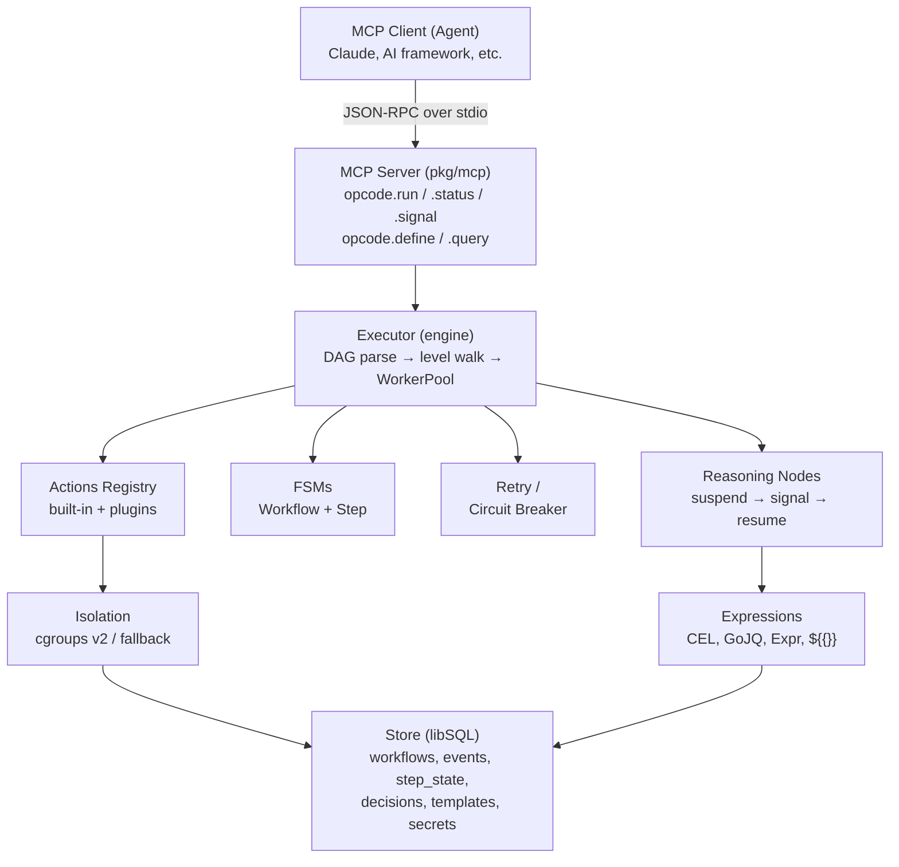

<div align="center">
  

  <picture>
    <source media="(prefers-color-scheme: dark)" srcset="assets/banner-dark.svg">
    
  </picture>

[](https://go.dev) [](LICENSE) [](https://github.com/rendis/opcode)

</div>

Agent-first workflow orchestration engine. OPCODE lets AI agents define, execute, and manage complex multi-step workflows through a Model Context Protocol (MCP) interface. Workflows are expressed as directed acyclic graphs (DAGs) with built-in support for reasoning nodes, flow control, event sourcing, process isolation, and secret management.

## Key Features

- **MCP-native interface** -- Five tools (`opcode.run`, `opcode.status`, `opcode.signal`, `opcode.define`, `opcode.query`) exposed over stdio for seamless agent integration
- **DAG-based execution** -- Steps execute level-by-level with automatic parallelism; dependencies are validated and cycle-detected at parse time
- **Reasoning nodes** -- First-class human-in-the-loop / agent-in-the-loop decision points that suspend workflows and resume on signal
- **Event sourcing** -- Append-only event log with materialized step states; full replay for resume after crash or suspension
- **Flow control** -- Conditions (CEL), loops (for_each/while/until), parallel branches, and wait steps
- **Expression engines** -- CEL for conditions, GoJQ for transforms, Expr for logic, plus `${{...}}` interpolation across all step params
- **Process isolation** -- Linux cgroups v2 (memory, CPU, PID namespace) with macOS fallback
- **Secret vault** -- AES-256-GCM encrypted secrets with PBKDF2 key derivation; resolved at runtime via `${{secrets.KEY}}`
- **Plugin system** -- MCP subprocess plugins with health checks, auto-restart, and dynamic action discovery
- **Cron scheduler** -- Background job scheduling with missed-run recovery
- **Circuit breakers** -- Per-action failure tracking with configurable thresholds
- **Structured errors** -- Typed error codes with retryability classification

## Table of Contents

- [Agent Skill](#agent-skill)
- [Tech Stack](#tech-stack)
- [Prerequisites](#prerequisites)
- [Getting Started](#getting-started)
- [Examples](#examples)
- [Architecture](#architecture)
- [MCP Tools Reference](#mcp-tools-reference)
- [Workflow Definition Format](#workflow-definition-format)
- [Built-in Actions](#built-in-actions)
- [Expression Interpolation](#expression-interpolation)
- [Environment Variables](#environment-variables)
- [Available Commands](#available-commands)
- [Testing](#testing)
- [Deployment](#deployment)
- [Troubleshooting](#troubleshooting)

## Agent Skill

OPCODE includes an agent skill that teaches AI coding agents (Claude Code, Cursor, etc.) how to define, execute, and manage workflows using the MCP tools. The skill provides reference documentation for workflow schemas, actions, expressions, error handling, and common patterns.

### Install via [skills.sh](https://skills.sh)

```bash
npx skills add https://github.com/rendis/opcode --skill opcode
```

### Install via [OpenClaw](https://clawhub.ai)

```bash
npx clawhub@latest install opcode
# or
pnpm dlx clawhub@latest install opcode
# or
bunx clawhub@latest install opcode
```

## Tech Stack

| Component              | Technology                                                                           |
| ---------------------- | ------------------------------------------------------------------------------------ |
| **Language**           | Go 1.25+                                                                             |
| **Database**           | Embedded libSQL (via `go-libsql`, CGO required)                                      |
| **MCP Server**         | `mcp-go` (stdio transport)                                                           |
| **Expression Engines** | CEL (`cel-go`), GoJQ (`gojq`), Expr (`expr-lang/expr`)                               |
| **Validation**         | JSON Schema Draft 2020-12 (`santhosh-tekuri/jsonschema/v6`)                          |
| **Scheduling**         | `robfig/cron/v3`                                                                     |
| **IDs**                | UUIDs (`google/uuid`)                                                                |
| **Testing**            | `testify`, embedded libSQL for integration tests                                     |
| **Isolation**          | Linux cgroups v2 + namespaces; macOS fallback (`os/exec` + timeout)                  |
| **Cryptography**       | AES-256-GCM (stdlib `crypto/aes` + `crypto/cipher`), PBKDF2 (stdlib `crypto/pbkdf2`) |

## Prerequisites

- **Go 1.25 or higher** -- required for module support and `crypto/pbkdf2` in stdlib
- **CGO enabled** -- required by `go-libsql` (the embedded SQLite/libSQL driver)
- **GCC / C compiler** -- needed for CGO compilation (`gcc` on Linux, Xcode Command Line Tools on macOS)
- **Docker** (optional) -- required only for running Linux isolation tests on macOS

Verify your Go installation:

```bash
go version
# go version go1.25 ...

# Ensure CGO is enabled (it is by default on most systems)
go env CGO_ENABLED
# 1
```

## Getting Started

### 1. Clone the Repository

```bash
git clone https://github.com/rendis/opcode.git
```

### 2. Install Dependencies

```bash
go build -C /path/to/opcode ./...
```

This downloads all Go modules and compiles the project. The CGO dependency on `go-libsql` means a C compiler must be available.

### 3. Build the Binary

```bash
go build -C /path/to/opcode -o opcode ./cmd/opcode/
```

This produces the `opcode` binary in the project root. The binary is a self-contained MCP server that communicates over stdio.

### 4. Run the Server

```bash
# Minimal: uses defaults (opcode.db in current directory, no vault)
./opcode

# With configuration
OPCODE_DB_PATH=/var/data/opcode.db \
OPCODE_VAULT_KEY="my-secret-passphrase" \
OPCODE_POOL_SIZE=20 \
OPCODE_LOG_LEVEL=debug \
./opcode
```

The server starts listening on stdin/stdout for MCP JSON-RPC messages. It is designed to be launched as a subprocess by an MCP client (such as Claude Desktop, an AI agent framework, or any MCP-compatible host).

### 5. Configure as an MCP Server

Add opcode to your MCP client configuration. For example, in Claude Desktop's `claude_desktop_config.json`:

```json
{
  "mcpServers": {
    "opcode": {
      "command": "/path/to/opcode",
      "env": {
        "OPCODE_DB_PATH": "/path/to/opcode.db",
        "OPCODE_VAULT_KEY": "your-vault-passphrase"
      }
    }
  }
}
```

### 6. Run the Test Suite

```bash
go test -C /path/to/opcode ./... -count=1 -timeout 60s
```

All 903 tests should pass. The tests use embedded libSQL with temporary database files and do not require any external services.

## Examples

44 ready-to-use workflow definitions in [`examples/`](examples/):

| Category              | Highlights                                                      |
| --------------------- | --------------------------------------------------------------- |
| **Agent Ops**         | content-summarizer, multi-source-research, iterative-refinement |
| **DevOps / CI-CD**    | deploy-gate, log-anomaly-triage, health-check-sweep             |
| **Data Pipelines**    | etl-with-validation, batch-file-processor, sync-drift-detection |
| **Human-in-the-Loop** | approval-chain, free-form-decision, escalation-ladder           |
| **Integrations**      | webhook-handler, lead-enrichment, two-way-sync                  |
| **Monitoring**        | error-aggregator, uptime-monitor, backup-verification           |
| **Security**          | secret-rotation, dependency-audit                               |
| **E-Commerce**        | order-processing, invoice-generator, price-monitor              |

Each example includes a `workflow.json` and a `README.md` with step-by-step explanation. See the full [examples catalog](examples/README.md) for feature index and script conventions.

## Architecture

### Directory Structure

```plaintext
opcode/
├── cmd/opcode/                  # Entry point, DI wiring, MCP server startup
│   └── main.go                  # Assembles all components and starts stdio transport
├── internal/
│   ├── actions/                 # Action interface and built-in action implementations
│   │   ├── action.go            # Action, ActionRegistry, ActionInput/Output interfaces
│   │   ├── registry.go          # Thread-safe Registry with plugin namespace support
│   │   ├── builtin.go           # RegisterBuiltins wiring function
│   │   ├── http.go              # HTTP actions (http.request, http.get, http.post)
│   │   ├── fs.go                # Filesystem actions (fs.read, fs.write, fs.list, fs.stat, fs.delete)
│   │   ├── shell.go             # Shell action (shell.exec) with isolator integration
│   │   ├── crypto.go            # Crypto actions (crypto.hash, crypto.hmac, crypto.uuid, crypto.encode, crypto.decode)
│   │   ├── assert.go            # Assertion actions (assert.equal, assert.schema, assert.truthy)
│   │   └── workflow.go          # Workflow actions (workflow.run, workflow.emit, workflow.context, workflow.fail, workflow.log)
│   ├── engine/                  # Core execution engine
│   │   ├── executor.go          # Executor interface + implementation (Run, Resume, Signal, Extend, Cancel, Status)
│   │   ├── executor_flow.go     # Flow control step execution (condition, loop, parallel, wait)
│   │   ├── dag.go               # DAG parser with Kahn's topological sort and level computation
│   │   ├── fsm.go               # Workflow FSM + Step FSM with transition validation and event emission
│   │   ├── worker.go            # Bounded goroutine pool with backpressure and panic recovery
│   │   ├── retry.go             # Retry logic with none/linear/exponential/constant backoff
│   │   ├── circuit_breaker.go   # Per-action circuit breaker (closed/open/half-open)
│   │   └── error_handler.go     # On-error strategy dispatch (ignore, fail_workflow, fallback_step)
│   ├── expressions/             # Expression evaluation and interpolation
│   │   ├── engine.go            # Engine interface (CEL, GoJQ, Expr)
│   │   ├── cel.go               # CEL engine for condition evaluation
│   │   ├── gojq.go              # GoJQ engine for JSON transforms
│   │   ├── expr.go              # Expr engine for logic expressions
│   │   ├── interpolation.go     # ${{...}} two-pass interpolation (variables then secrets)
│   │   └── scope.go             # InterpolationScope builder
│   ├── store/                   # Persistence layer
│   │   ├── store.go             # Store interface (~20 methods)
│   │   ├── types.go             # Domain types (Workflow, Event, StepState, PendingDecision, etc.)
│   │   ├── libsql.go            # libSQL/SQLite implementation
│   │   ├── eventlog.go          # EventLog wrapper with replay capability
│   │   ├── migrations.go        # Migration runner
│   │   └── migrations/          # SQL migration files
│   │       └── 001_initial_schema.sql
│   ├── reasoning/               # Reasoning node support
│   │   ├── context.go           # BuildDecisionContext (collects step outputs, intent, data injects)
│   │   └── validation.go        # ValidateResolution (choice against available options)
│   ├── identity/                # Agent identity management
│   │   └── agent.go             # Agent registration and validation
│   ├── secrets/                 # Secret vault
│   │   ├── vault.go             # Vault interface (Resolve, Store, Delete, List)
│   │   └── aes_vault.go         # AES-256-GCM implementation with PBKDF2 key derivation
│   ├── isolation/               # Process isolation
│   │   ├── isolator.go          # Isolator interface, ResourceLimits, path validation
│   │   ├── linux.go             # LinuxIsolator (cgroups v2, PID namespace, memory/CPU limits)
│   │   ├── fallback.go          # FallbackIsolator (os/exec + timeout, path validation only)
│   │   ├── factory_linux.go     # Auto-detect: Linux → LinuxIsolator
│   │   └── factory_default.go   # Auto-detect: non-Linux → FallbackIsolator
│   ├── plugins/                 # MCP plugin system
│   │   ├── manager.go           # PluginManager (lifecycle, health checks, restart, action discovery)
│   │   └── provider.go          # Plugin provider interface
│   ├── streaming/               # Real-time event pub/sub
│   │   ├── hub.go               # EventHub interface
│   │   └── memory_hub.go        # In-memory fan-out implementation
│   ├── scheduler/               # Cron-based job scheduling
│   │   └── scheduler.go         # Background loop, missed-run recovery, dedup
│   ├── validation/              # Workflow definition validation
│   │   ├── validator.go         # Validator interface
│   │   ├── workflow.go          # Full workflow validation pipeline
│   │   ├── dag_check.go         # DAG-specific checks (cycles, orphans, missing deps)
│   │   ├── semantic.go          # Semantic validation (action existence, param types)
│   │   └── jsonschema.go        # JSON Schema Draft 2020-12 validation
│   └── logging/                 # Structured logging with correlation IDs
│       └── context.go           # Context-based workflow/step/agent ID propagation
├── pkg/
│   ├── schema/                  # Public API types
│   │   ├── workflow.go          # WorkflowDefinition, StepDefinition, configs (Reasoning, Parallel, Loop, Condition, Wait)
│   │   ├── events.go            # Event type constants, WorkflowStatus, StepStatus
│   │   ├── errors.go            # OpcodeError with typed error codes and retryability
│   │   ├── signal.go            # Signal types, DAGMutation, VariableSet
│   │   └── validation.go        # ValidationResult, ValidationIssue
│   └── mcp/                     # MCP server and tool definitions
│       ├── server.go            # OpcodeServer (5 tools, stdio transport)
│       └── tools.go             # Tool handlers (run, status, signal, define, query)
├── tests/
│   └── e2e/                     # End-to-end integration tests
├── scripts/
│   └── test-linux.sh            # Docker-based Linux isolation test runner
├── Dockerfile.test              # Docker image for Linux cgroup tests
├── go.mod
└── go.sum
```

### System Overview



### Request Lifecycle


**Key behaviors during execution:**

- Each step transitions through FSM states: `pending -> scheduled -> running -> completed/failed`
- Reasoning steps create a PendingDecision, emit `decision_requested`, and suspend the workflow
- On failure, the error handler applies retry policies (with backoff) or on_error strategies
- All state changes are persisted as append-only events; `step_state` is a materialized view

### Event Sourcing Model

OPCODE uses event sourcing as its persistence strategy. Every state change is recorded as an immutable event. The `step_state` table is a materialized view derived from events.


This design enables:

- **Full auditability** -- every action is recorded with a timestamp and sequence number
- **Reliable resume** -- after a crash or suspension, events are replayed to rebuild exact state
- **Reasoning node safety** -- decisions stored as `decision_resolved` events, never replayed (the agent's choice is final)

### State Machines

**Workflow FSM:**


**Step FSM:**


### Database Schema

The embedded libSQL database contains 10 tables:

| Table                | Purpose                                                       |
| -------------------- | ------------------------------------------------------------- |
| `agents`             | Registered agent identities (LLM, system, human, service)     |
| `workflows`          | Workflow execution records with status, definition, I/O       |
| `events`             | Append-only event sourcing log (unique per workflow+sequence) |
| `step_state`         | Materialized view of current step execution state             |
| `workflow_context`   | Per-workflow metadata (intent, agent notes, accumulated data) |
| `pending_decisions`  | Reasoning nodes awaiting agent input                          |
| `workflow_templates` | Reusable workflow definitions (name+version composite key)    |
| `plugins`            | Registered MCP plugin subprocesses                            |
| `secrets`            | AES-256-GCM encrypted key-value secrets                       |
| `scheduled_jobs`     | Cron-triggered workflow executions                            |

An additional `audit_log` table is defined for flag-activated agent action auditing.

## MCP Tools Reference

OPCODE exposes five MCP tools over stdio:

### opcode.run

Execute a workflow from a registered template.

| Parameter       | Required | Description                             |
| --------------- | -------- | --------------------------------------- |
| `template_name` | Yes      | Name of the workflow template           |
| `version`       | No       | Template version (default: latest)      |
| `params`        | No       | Input parameters as a JSON object       |
| `agent_id`      | Yes      | ID of the agent initiating the workflow |

Returns an `ExecutionResult` with `workflow_id`, `status`, `output`, `error`, and per-step results.

### opcode.status

Get the current state of a workflow.

| Parameter     | Required | Description                 |
| ------------- | -------- | --------------------------- |
| `workflow_id` | Yes      | ID of the workflow to query |

Returns the workflow status, step states, pending decisions, workflow context, and event history.

### opcode.signal

Send a signal to a suspended workflow (e.g., resolve a reasoning decision).

| Parameter     | Required | Description                                              |
| ------------- | -------- | -------------------------------------------------------- |
| `workflow_id` | Yes      | Target workflow ID                                       |
| `signal_type` | Yes      | One of:`decision`, `data`, `cancel`, `retry`, `skip`     |
| `payload`     | Yes      | Signal payload (for decisions:`{"choice": "option_id"}`) |
| `step_id`     | No       | Target step ID (required for decision signals)           |
| `agent_id`    | No       | ID of the signaling agent                                |
| `reasoning`   | No       | Agent's reasoning for the signal                         |

### opcode.define

Register a reusable workflow template with auto-versioning.

| Parameter       | Required | Description                       |
| --------------- | -------- | --------------------------------- |
| `name`          | Yes      | Template name                     |
| `definition`    | Yes      | Workflow definition object        |
| `agent_id`      | Yes      | ID of the defining agent          |
| `description`   | No       | Template description              |
| `input_schema`  | No       | JSON Schema for input validation  |
| `output_schema` | No       | JSON Schema for output validation |
| `triggers`      | No       | Trigger configuration             |

Returns the template `name` and auto-incremented `version` (v1, v2, v3...).

### opcode.query

Query workflows, events, or templates with filtering.

| Parameter  | Required | Description                               |
| ---------- | -------- | ----------------------------------------- |
| `resource` | Yes      | One of:`workflows`, `events`, `templates` |
| `filter`   | No       | Filter criteria object                    |

**Filter fields by resource:**

| Resource    | Filter Fields                                            |
| ----------- | -------------------------------------------------------- |
| `workflows` | `status`, `agent_id`, `since` (RFC3339), `limit`         |
| `events`    | `workflow_id`, `step_id`, `event_type`, `since`, `limit` |
| `templates` | `name`, `agent_id`, `limit`                              |

## Workflow Definition Format

A workflow is defined as a JSON object with steps, optional lifecycle hooks, and metadata:

```json
{
  "steps": [
    {
      "id": "fetch_data",
      "action": "http.get",
      "params": {
        "url": "https://api.example.com/data"
      },
      "timeout": "30s",
      "retry": {
        "max": 3,
        "backoff": "exponential",
        "delay": "1s",
        "max_delay": "10s"
      }
    },
    {
      "id": "transform",
      "action": "http.post",
      "depends_on": ["fetch_data"],
      "params": {
        "url": "https://api.example.com/process",
        "body": "${{steps.fetch_data.result}}"
      }
    },
    {
      "id": "review",
      "type": "reasoning",
      "depends_on": ["transform"],
      "config": {
        "prompt_context": "Review the processed data and decide next action",
        "options": [
          { "id": "approve", "description": "Data looks good, proceed" },
          { "id": "reject", "description": "Data has issues, stop" }
        ],
        "timeout": "1h",
        "fallback": "approve"
      }
    }
  ],
  "timeout": "5m",
  "on_timeout": "fail",
  "inputs": {
    "api_key": "${{secrets.API_KEY}}"
  }
}
```

### Step Types

| Type               | Description                                        | Required Config                               |
| ------------------ | -------------------------------------------------- | --------------------------------------------- |
| `action` (default) | Execute a registered action                        | `action` field (action name)                  |
| `reasoning`        | Create a decision point that suspends the workflow | `config.prompt_context`                       |
| `condition`        | Branch based on a CEL expression                   | `config.expression`, `config.branches`        |
| `loop`             | Iterate over a collection or condition             | `config.body`, plus `over`/`condition`/`mode` |
| `parallel`         | Execute branches concurrently                      | `config.branches` (array of step arrays)      |
| `wait`             | Pause for a duration or until a signal             | `config.duration` or `config.signal`          |

### Error Handling

Each step can define an `on_error` strategy:

| Strategy        | Behavior                                                    |
| --------------- | ----------------------------------------------------------- |
| `ignore`        | Mark step as completed (error swallowed), continue workflow |
| `fail_workflow` | Immediately fail the entire workflow                        |
| `fallback_step` | Execute a designated fallback step                          |
| `retry`         | Defer to the retry policy                                   |

### Retry Policies

```json
{
  "retry": {
    "max": 5,
    "backoff": "exponential",
    "delay": "500ms",
    "max_delay": "30s"
  }
}
```

Backoff strategies: `none` (immediate retry), `linear` (delay _ attempt), `exponential` (delay _ 2^attempt), `constant` (fixed delay). Non-retryable errors (validation, permission denied, assertion failures) are never retried regardless of policy.

### Workflow Timeout

The `timeout` field at the workflow level sets a hard deadline. The `on_timeout` field controls behavior when the deadline fires:

| Value            | Behavior                                             |
| ---------------- | ---------------------------------------------------- |
| `fail` (default) | Fail the workflow with a timeout error               |
| `suspend`        | Suspend the workflow (can be resumed later)          |
| `cancel`         | Cancel the workflow, skipping all non-terminal steps |

## Built-in Actions

OPCODE ships with a comprehensive set of built-in actions:

### HTTP Actions

| Action         | Description                                                       |
| -------------- | ----------------------------------------------------------------- |
| `http.request` | General HTTP request with full control over method, headers, body |
| `http.get`     | Convenience GET request                                           |
| `http.post`    | Convenience POST request                                          |

### Filesystem Actions

| Action      | Description                                |
| ----------- | ------------------------------------------ |
| `fs.read`   | Read file contents                         |
| `fs.write`  | Write content to a file                    |
| `fs.list`   | List directory contents                    |
| `fs.stat`   | Get file metadata (size, mode, timestamps) |
| `fs.delete` | Delete a file                              |

Filesystem actions respect the isolator's path validation (deny paths, read-only paths, writable paths).

### Shell Actions

| Action       | Description                                                               |
| ------------ | ------------------------------------------------------------------------- |
| `shell.exec` | Execute a shell command with timeout and resource limits via the isolator |

### Crypto Actions

| Action          | Description                              |
| --------------- | ---------------------------------------- |
| `crypto.hash`   | Compute SHA-256 (or other) hash of input |
| `crypto.hmac`   | Compute HMAC signature                   |
| `crypto.uuid`   | Generate a new UUID                      |
| `crypto.encode` | Encode data (base64, hex)                |
| `crypto.decode` | Decode data (base64, hex)                |

### Assert Actions

| Action          | Description                         |
| --------------- | ----------------------------------- |
| `assert.equal`  | Assert two values are equal         |
| `assert.schema` | Validate data against a JSON Schema |
| `assert.truthy` | Assert a value is truthy            |

### Workflow Actions

| Action             | Description                                                     |
| ------------------ | --------------------------------------------------------------- |
| `workflow.run`     | Execute a child workflow from a template (sub-workflow)         |
| `workflow.emit`    | Publish a custom event to the EventHub                          |
| `workflow.context` | Read or update workflow context (accumulated data, agent notes) |
| `workflow.fail`    | Force-fail the current workflow with a reason                   |
| `workflow.log`     | Write a structured log entry with workflow context              |

### Plugin Actions

External MCP servers can be loaded as plugins. Their tools are discovered via `tools/list` and registered in the action registry under a namespaced prefix (e.g., `github.create_issue`).

## Expression Interpolation

OPCODE supports `${{...}}` variable interpolation in step parameters. Interpolation is resolved in two passes: first non-secret variables, then secrets.

### Available Scopes

| Scope             | Syntax                              | Description                                           |
| ----------------- | ----------------------------------- | ----------------------------------------------------- |
| Step outputs      | `${{steps.step_id.field}}`          | Output from a completed step                          |
| Workflow inputs   | `${{inputs.param_name}}`            | Workflow input parameters                             |
| Workflow metadata | `${{workflow.run_id}}`              | Workflow execution metadata                           |
| Context           | `${{context.intent}}`               | Workflow context (intent, agent_id, accumulated data) |
| Secrets           | `${{secrets.KEY}}`                  | Resolved from the encrypted vault at runtime          |
| Loop variables    | `${{loop.item}}`, `${{loop.index}}` | Available inside loop step bodies                     |

### Expression Engines

Three expression engines are available for conditions and transforms:

| Engine   | Use Case                                    | Syntax Example                     |
| -------- | ------------------------------------------- | ---------------------------------- |
| **CEL**  | Condition evaluation, type-safe expressions | `steps.fetch.status_code == 200`   |
| **GoJQ** | JSON transformation and querying            | `.data[] \| select(.active)`       |
| **Expr** | General-purpose logic expressions           | `len(items) > 0 && items[0].valid` |

Note: CEL reserves the word `loop`. Inside CEL expressions, use `iter.item` and `iter.index` instead of `loop.item` / `loop.index`. The `${{loop.item}}` interpolation syntax is unaffected.

## Environment Variables

### Required

None. OPCODE runs with sensible defaults and an embedded database.

### Optional

| Variable           | Description                                           | Default                  |
| ------------------ | ----------------------------------------------------- | ------------------------ |
| `OPCODE_DB_PATH`   | Path to the libSQL database file                      | `opcode.db`              |
| `OPCODE_VAULT_KEY` | Passphrase for the AES-256-GCM secret vault           | (empty = vault disabled) |
| `OPCODE_POOL_SIZE` | Maximum concurrent step goroutines in the worker pool | `10`                     |
| `OPCODE_LOG_LEVEL` | Log verbosity:`debug`, `info`, `warn`, `error`        | `info`                   |

When `OPCODE_VAULT_KEY` is not set, the server starts without vault support and logs a warning. Secret interpolation (`${{secrets.KEY}}`) will fail at runtime if the vault is not initialized.

## Available Commands

| Command                                                              | Description                                |
| -------------------------------------------------------------------- | ------------------------------------------ |
| `go build -C /path/to/opcode ./...`                                  | Build all packages (verify compilation)    |
| `go build -C /path/to/opcode -o opcode ./cmd/opcode/`                | Build the opcode binary                    |
| `go test -C /path/to/opcode ./... -count=1 -timeout 60s`             | Run the full test suite (903 tests)        |
| `go test -C /path/to/opcode ./internal/engine/ -run TestExecutor -v` | Run a specific test subset                 |
| `go test -C /path/to/opcode ./internal/engine/ -v`                   | Run all engine tests verbosely             |
| `go test -C /path/to/opcode ./tests/e2e/ -v`                         | Run end-to-end integration tests           |
| `bash scripts/test-linux.sh`                                         | Run Linux cgroup isolation tests in Docker |
| `go vet -C /path/to/opcode ./...`                                    | Run Go static analysis                     |

## Testing

### Running Tests

```bash
# Run the full test suite
go test -C /path/to/opcode ./... -count=1 -timeout 60s

# Run tests for a specific package
go test -C /path/to/opcode ./internal/engine/ -v

# Run tests matching a pattern
go test -C /path/to/opcode ./internal/engine/ -run TestExecutor -v

# Run with race detector
go test -C /path/to/opcode ./... -race -count=1 -timeout 120s
```

### Test Architecture

Tests run directly on macOS with the FallbackIsolator. Linux-specific isolation tests (cgroups v2, PID namespaces, OOM kills) run inside Docker:

```bash
# Build and run Linux isolation tests
bash scripts/test-linux.sh
```

This builds a Docker image from `Dockerfile.test` and runs it with `--privileged --cgroupns=host` for full cgroup access.

### Test Organization

| Package                 | Test Focus                                                                    |
| ----------------------- | ----------------------------------------------------------------------------- |
| `internal/store/`       | Real embedded libSQL (temp file per test), CRUD operations, event replay      |
| `internal/engine/`      | Executor, DAG parsing, FSM transitions, retry, circuit breakers, flow control |
| `internal/actions/`     | Action execution, input validation, HTTP/FS/shell/crypto/assert actions       |
| `internal/expressions/` | CEL/GoJQ/Expr evaluation, interpolation, scope building                       |
| `internal/isolation/`   | Path validation, FallbackIsolator (macOS), LinuxIsolator (Docker)             |
| `internal/reasoning/`   | Decision context building, resolution validation                              |
| `internal/identity/`    | Agent registration and validation                                             |
| `internal/secrets/`     | AES vault encrypt/decrypt, key derivation                                     |
| `internal/streaming/`   | EventHub publish/subscribe, fan-out                                           |
| `internal/validation/`  | Workflow definition validation, DAG checks, JSON Schema                       |
| `internal/plugins/`     | Plugin lifecycle, MCP handshake, action discovery                             |
| `internal/scheduler/`   | Cron parsing, job scheduling, missed-run recovery                             |
| `pkg/mcp/`              | MCP tool handlers, request/response serialization                             |
| `pkg/schema/`           | Validation result types                                                       |
| `tests/e2e/`            | Full end-to-end workflow execution, MCP integration                           |

### Key Testing Patterns

- **Store tests** use real embedded libSQL with a temporary database file per test -- no mocks for persistence
- **Engine tests** use the `EventLogger` interface with mock implementations to avoid CGO dependencies in unit tests
- **Test helpers** are prefixed per file to avoid naming collisions (e.g., `execActionStep` in executor_test vs `actionStep` in dag_test)
- **Assertions** use `testify/assert` and `testify/require`

## Deployment

OPCODE is a single Go binary with an embedded database. It does not require external services.

### Binary Deployment

Build a static binary and deploy it alongside its database file:

```bash
# Build for Linux (from macOS)
CGO_ENABLED=1 GOOS=linux GOARCH=amd64 \
  CC=x86_64-linux-musl-gcc \
  go build -C /path/to/opcode -o opcode-linux ./cmd/opcode/

# Or build natively on the target system
go build -C /path/to/opcode -o opcode ./cmd/opcode/
```

Note: Cross-compilation requires a cross-compiling C toolchain due to the CGO dependency on `go-libsql`.

### Docker Deployment

Create a `Dockerfile` for production:

```dockerfile
FROM golang:1.25-bookworm AS builder

RUN apt-get update && apt-get install -y --no-install-recommends gcc libc6-dev

WORKDIR /src
COPY go.mod go.sum ./
RUN go mod download
COPY . .
RUN CGO_ENABLED=1 go build -o /opcode ./cmd/opcode/

FROM debian:bookworm-slim
RUN apt-get update && apt-get install -y --no-install-recommends ca-certificates && rm -rf /var/lib/apt/lists/*
COPY --from=builder /opcode /usr/local/bin/opcode

ENV OPCODE_DB_PATH=/data/opcode.db
VOLUME /data

ENTRYPOINT ["opcode"]
```

```bash
docker build -t opcode .
docker run -v opcode-data:/data \
  -e OPCODE_VAULT_KEY="your-vault-passphrase" \
  opcode
```

### Production Considerations

- **Database backups**: The libSQL database file (`opcode.db` plus WAL files `opcode.db-wal`, `opcode.db-shm`) should be backed up regularly. The database supports WAL mode for concurrent reads.
- **Vault key management**: The `OPCODE_VAULT_KEY` passphrase derives the AES-256 encryption key via PBKDF2 (100,000 iterations). Store it in a secrets manager, not in environment files.
- **Worker pool sizing**: Set `OPCODE_POOL_SIZE` based on expected concurrent workflow step count. Each slot is a goroutine; the pool applies backpressure when full.
- **Linux isolation**: On Linux with cgroups v2, OPCODE can enforce memory limits, CPU quotas, and PID namespace isolation for shell commands. The process requires appropriate cgroup permissions.
- **Graceful shutdown**: OPCODE handles `SIGTERM` and `SIGINT` for graceful shutdown (10-second timeout). The scheduler, plugins, and active workflows are stopped cleanly.
- **Log output**: Logs are written to stderr in JSON format with correlation IDs (workflow_id, step_id, agent_id) automatically injected.

## Troubleshooting

### CGO Build Failures

**Error:** `cgo: C compiler "gcc" not found` or linker errors

**Solution:**

```bash
# macOS: install Xcode Command Line Tools
xcode-select --install

# Linux (Debian/Ubuntu)
sudo apt-get install gcc libc6-dev

# Verify CGO is enabled
go env CGO_ENABLED
# Should output: 1
```

### Database Locked Errors

**Error:** `database is locked` during concurrent access

**Solution:** OPCODE uses WAL mode for the libSQL database, which supports concurrent reads. If you see lock errors, ensure only one OPCODE process is writing to the database file. Multiple readers are safe.

### Vault Not Initialized

**Error:** `[VAULT_ERROR] vault not initialized` when using `${{secrets.KEY}}`

**Solution:** Set the `OPCODE_VAULT_KEY` environment variable before starting the server. Without it, secret interpolation is disabled.

```bash
OPCODE_VAULT_KEY="your-passphrase" ./opcode
```

### Linux Isolation Test Failures

**Error:** Tests in `internal/isolation/` fail on macOS

**Solution:** Linux-specific tests (cgroups, PID namespaces) must run in Docker:

```bash
bash scripts/test-linux.sh
```

The script builds a Docker image and runs with `--privileged --cgroupns=host`. macOS tests use the FallbackIsolator and should pass natively.

### Decision Timeout Without Fallback

**Error:** `[TIMEOUT_ERROR] decision timeout for step X: no fallback option configured`

**Solution:** When a reasoning node times out and has no `fallback` option configured, the workflow fails. Either:

1. Add a `fallback` option to the reasoning config
2. Resolve the decision before the timeout via `opcode.signal`
3. Remove the `timeout` from the reasoning config (decision waits indefinitely)

### Step Interpolation Failures

**Error:** `[INTERPOLATION_ERROR] interpolation failed for step action "..."`

**Solution:** Check that referenced step IDs in `${{steps.step_id.field}}` match actual step IDs in the workflow definition. Ensure the referenced step completes before the current step runs (use `depends_on`).

### Circuit Breaker Open

**Error:** `[CIRCUIT_OPEN] circuit breaker open for action "..."`

**Solution:** The circuit breaker has tripped due to consecutive failures of that action. Wait for the configured half-open interval, then the next request will be allowed through as a probe. If the probe succeeds, the circuit closes. If the underlying issue persists, fix the root cause (network, service availability, etc.) before retrying.

### Path Denied Errors

**Error:** `[PATH_DENIED] write access to "/path" denied`

**Solution:** The isolator's path validation is blocking filesystem access. Check the `ResourceLimits` configuration for `deny_paths`, `read_only_paths`, and `writable_paths`. Deny paths always take precedence.
