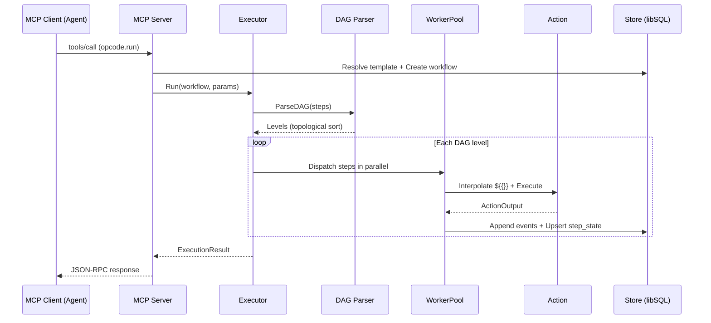
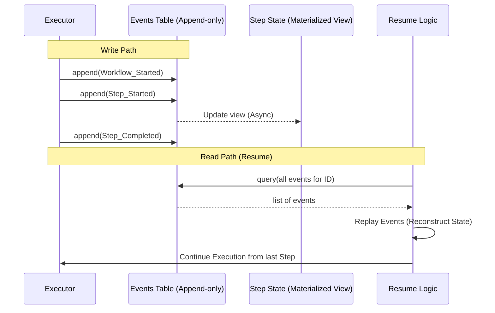
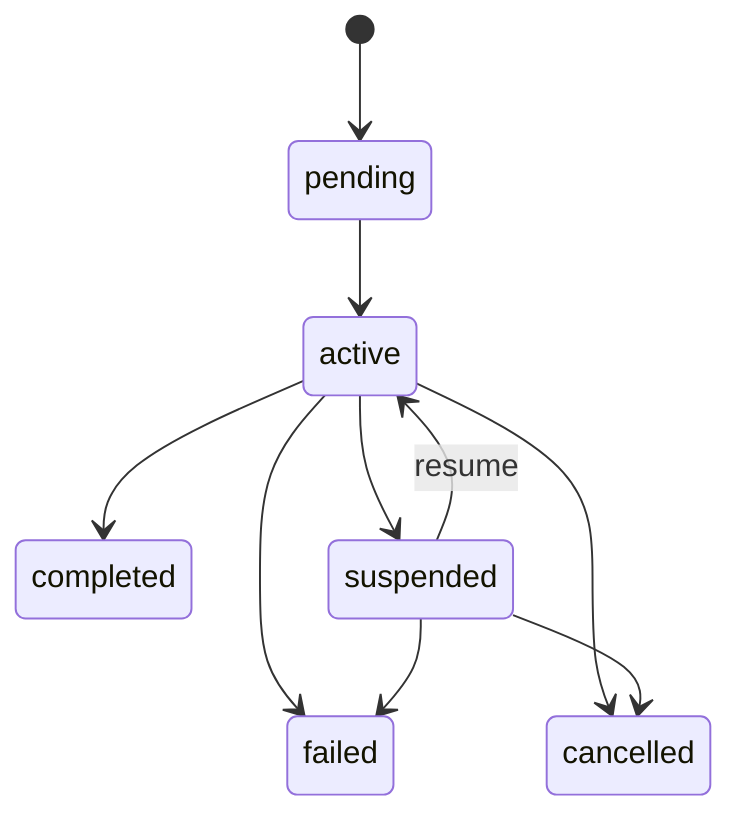
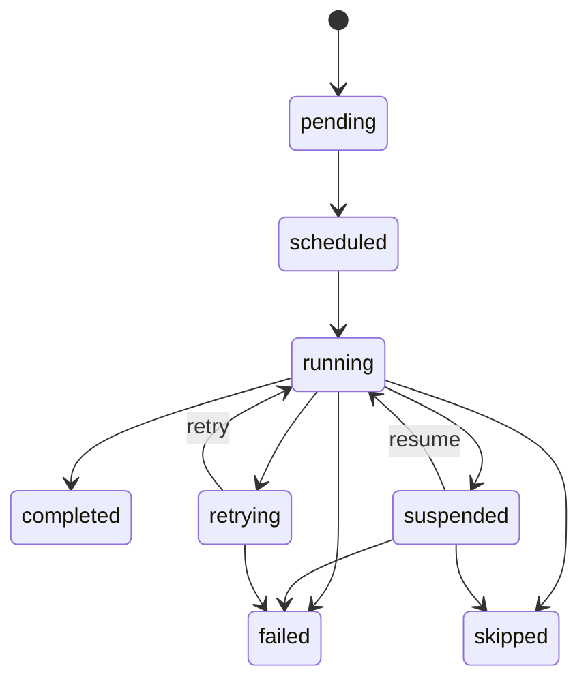

# OPCODE — Architecture

## Directory Structure

```plaintext
opcode/
├── cmd/opcode/                  # Entry point, DI wiring, SSE daemon + panel
│   └── main.go                  # Assembles all components, HTTP server (MCP SSE + panel)
├── internal/
│   ├── actions/                 # Action interface and built-in action implementations
│   │   ├── action.go            # Action, ActionRegistry, ActionInput/Output interfaces
│   │   ├── registry.go          # Thread-safe Registry with plugin namespace support
│   │   ├── builtin.go           # RegisterBuiltins wiring function
│   │   ├── http.go              # HTTP actions (http.request, http.get, http.post)
│   │   ├── fs.go                # Filesystem actions (fs.read, fs.write, fs.list, fs.stat, fs.delete)
│   │   ├── shell.go             # Shell action (shell.exec) with isolator integration
│   │   ├── crypto.go            # Crypto actions (crypto.hash, crypto.hmac, crypto.uuid, crypto.encode, crypto.decode)
│   │   ├── assert.go            # Assertion actions (assert.equal, assert.schema, assert.truthy)
│   │   └── workflow.go          # Workflow actions (workflow.run, workflow.emit, workflow.context, workflow.fail, workflow.log, workflow.notify)
│   ├── engine/                  # Core execution engine
│   │   ├── executor.go          # Executor interface + implementation (Run, Resume, Signal, Extend, Cancel, Status)
│   │   ├── executor_flow.go     # Flow control step execution (condition, loop, parallel, wait)
│   │   ├── dag.go               # DAG parser with Kahn's topological sort and level computation
│   │   ├── fsm.go               # Workflow FSM + Step FSM with transition validation and event emission
│   │   ├── worker.go            # Bounded goroutine pool with backpressure and panic recovery
│   │   ├── retry.go             # Retry logic with none/linear/exponential/constant backoff
│   │   ├── circuit_breaker.go   # Per-action circuit breaker (closed/open/half-open)
│   │   └── error_handler.go     # On-error strategy dispatch (ignore, fail_workflow, fallback_step)
│   ├── expressions/             # Expression evaluation and interpolation
│   │   ├── engine.go            # Engine interface (CEL, GoJQ, Expr)
│   │   ├── cel.go               # CEL engine for condition evaluation
│   │   ├── gojq.go              # GoJQ engine for JSON transforms
│   │   ├── expr.go              # Expr engine for logic expressions
│   │   ├── interpolation.go     # ${{...}} two-pass interpolation (variables then secrets)
│   │   └── scope.go             # InterpolationScope builder
│   ├── diagram/                 # Workflow visualization
│   │   ├── model.go            # DiagramModel intermediate representation (nodes, edges, subgraphs)
│   │   ├── builder.go          # WorkflowDefinition + StepStates → DiagramModel
│   │   ├── ascii.go            # ASCII renderer (box-drawing characters, status tags)
│   │   ├── mermaid.go          # Mermaid flowchart renderer (classDef status colors)
│   │   └── graphviz.go         # PNG renderer via go-graphviz (DOT graph → image)
│   ├── panel/                   # Web management panel
│   │   ├── server.go           # PanelServer, HTTP handler, template parsing, embed.FS
│   │   ├── handlers.go         # Page handlers (dashboard, workflows, templates, decisions, etc.)
│   │   ├── api.go              # POST/DELETE endpoints (resolve decision, cancel workflow, etc.)
│   │   ├── sse.go              # EventHub → SSE bridge (global + per-workflow streams)
│   │   ├── templates/          # Go html/templates (base layout + per-page)
│   │   └── static/             # Embedded assets (pico.css, htmx.js, mermaid.js, panel.css)
│   ├── store/                   # Persistence layer
│   │   ├── store.go             # Store interface (~20 methods)
│   │   ├── types.go             # Domain types (Workflow, Event, StepState, PendingDecision, etc.)
│   │   ├── libsql.go            # libSQL implementation
│   │   ├── eventlog.go          # EventLog wrapper with replay capability
│   │   ├── migrations.go        # Migration runner
│   │   └── migrations/          # SQL migration files
│   │       └── 001_initial_schema.sql
│   ├── reasoning/               # Reasoning node support
│   │   ├── context.go           # BuildDecisionContext (collects step outputs, intent, data injects)
│   │   └── validation.go        # ValidateResolution (choice against available options)
│   ├── identity/                # Agent identity management
│   │   └── agent.go             # Agent registration and validation
│   ├── secrets/                 # Secret vault
│   │   ├── vault.go             # Vault interface (Resolve, Store, Delete, List)
│   │   └── aes_vault.go         # AES-256-GCM implementation with PBKDF2 key derivation
│   ├── isolation/               # Process isolation
│   │   ├── isolator.go          # Isolator interface, ResourceLimits, path validation
│   │   ├── linux.go             # LinuxIsolator (cgroups v2, PID namespace, memory/CPU limits)
│   │   ├── fallback.go          # FallbackIsolator (os/exec + timeout, path validation only)
│   │   ├── factory_linux.go     # Auto-detect: Linux → LinuxIsolator
│   │   └── factory_default.go   # Auto-detect: non-Linux → FallbackIsolator
│   ├── plugins/                 # MCP plugin system
│   │   ├── manager.go           # PluginManager (lifecycle, health checks, restart, action discovery)
│   │   └── provider.go          # Plugin provider interface
│   ├── streaming/               # Real-time event pub/sub
│   │   ├── hub.go               # EventHub interface
│   │   └── memory_hub.go        # In-memory fan-out implementation
│   ├── scheduler/               # Cron-based job scheduling
│   │   └── scheduler.go         # Background loop, missed-run recovery, dedup
│   ├── validation/              # Workflow definition validation
│   │   ├── validator.go         # Validator interface
│   │   ├── workflow.go          # Full workflow validation pipeline
│   │   ├── dag_check.go         # DAG-specific checks (cycles, orphans, missing deps)
│   │   ├── semantic.go          # Semantic validation (action existence, param types)
│   │   └── jsonschema.go        # JSON Schema Draft 2020-12 validation
│   └── logging/                 # Structured logging with correlation IDs
│       └── context.go           # Context-based workflow/step/agent ID propagation
├── pkg/
│   ├── schema/                  # Public API types
│   │   ├── workflow.go          # WorkflowDefinition, StepDefinition, configs (Reasoning, Parallel, Loop, Condition, Wait)
│   │   ├── events.go            # Event type constants, WorkflowStatus, StepStatus
│   │   ├── errors.go            # OpcodeError with typed error codes and retryability
│   │   ├── signal.go            # Signal types, DAGMutation, VariableSet
│   │   └── validation.go        # ValidationResult, ValidationIssue
│   └── mcp/                     # MCP server and tool definitions
│       ├── server.go            # OpcodeServer (6 tools, SSE transport)
│       └── tools.go             # Tool handlers (run, status, signal, define, query, diagram)
├── tests/
│   └── e2e/                     # End-to-end integration tests
├── scripts/
│   └── test-linux.sh            # Docker-based Linux isolation test runner
├── Dockerfile.test              # Docker image for Linux cgroup tests
├── go.mod
└── go.sum
```

---

## Request Lifecycle



**Key behaviors during execution:**

- Each step transitions through FSM states: `pending -> scheduled -> running -> completed/failed`
- Reasoning steps create a PendingDecision, emit `decision_requested`, and suspend the workflow
- On failure, the error handler applies retry policies (with backoff) or on_error strategies
- All state changes are persisted as append-only events; `step_state` is a materialized view

---

## Event Sourcing Model

OPCODE uses event sourcing as its persistence strategy. Every state change is recorded as an immutable event. The `step_state` table is a materialized view derived from events.



This design enables:

- **Full auditability** -- every action is recorded with a timestamp and sequence number
- **Reliable resume** -- after a crash or suspension, events are replayed to rebuild exact state
- **Reasoning node safety** -- decisions stored as `decision_resolved` events, never replayed (the agent's choice is final)

---

## State Machines

**Workflow FSM:**



**Step FSM:**



---

## Database Schema

The embedded libSQL database contains 10 tables:

| Table                | Purpose                                                       |
| -------------------- | ------------------------------------------------------------- |
| `agents`             | Registered agent identities (LLM, system, human, service)     |
| `workflows`          | Workflow execution records with status, definition, I/O       |
| `events`             | Append-only event sourcing log (unique per workflow+sequence) |
| `step_state`         | Materialized view of current step execution state             |
| `workflow_context`   | Per-workflow metadata (intent, agent notes, accumulated data) |
| `pending_decisions`  | Reasoning nodes awaiting agent input                          |
| `workflow_templates` | Reusable workflow definitions (name+version composite key)    |
| `plugins`            | Registered MCP plugin subprocesses                            |
| `secrets`            | AES-256-GCM encrypted key-value secrets                       |
| `scheduled_jobs`     | Cron-triggered workflow executions                            |

An additional `audit_log` table is defined for flag-activated agent action auditing.

---

## ASCII Diagram Format

Text-based box-drawing diagram for CLI agents and terminal output. When [`mermaid-ascii`](https://github.com/AlexanderGrooff/mermaid-ascii) is installed (auto-downloaded by `opcode install`), diagrams use its layout engine for superior branching, edge routing, and diamond merges. Falls back to a built-in renderer otherwise.

```plaintext
=== Workflow ===

┌───────┐
│ Start │
└───────┘
       │
       ▼
┌────────────┐
│ fetch-data │
│ [OK]       │
│ 450ms      │
└────────────┘
       │
       ▼
┌──────────┐
│ validate │
│ [OK]     │
│ 12ms     │
└──────────┘
       │
       ▼
┌────────┐
│ decide │
│ [WAIT] │
└────────┘
       │
       ▼
┌─────────┐
│ process │
│ [PEND]  │
└─────────┘
       │
       ▼
┌────────┐
│ notify │
│ [PEND] │
└────────┘
       │
       ▼
┌─────┐
│ End │
└─────┘
```

Status tags: `[OK]` completed, `[FAIL]` failed, `[RUN]` running, `[WAIT]` suspended, `[PEND]` pending, `[SKIP]` skipped, `[RETRY]` retrying.

---

See also: [Design Rationale &amp; Trade-offs](design-rationale.md) | [Benchmarks](benchmarks.md)
