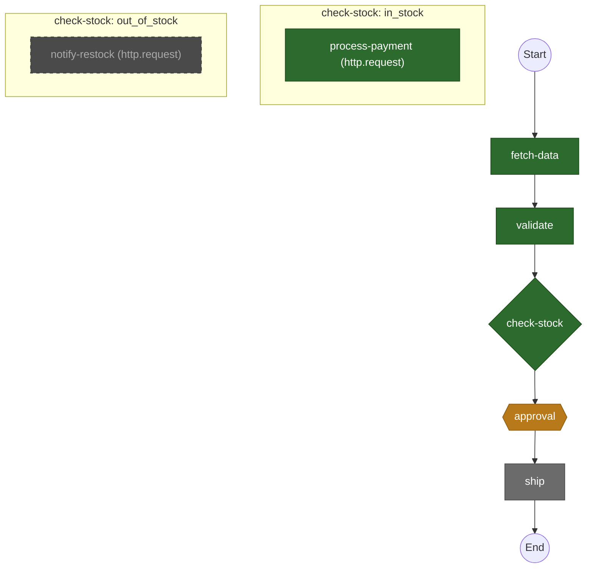

```mermaid
graph TD
    %% Workflow
    __start__(("Start"))
    fetch_data["fetch-data"]
    validate["validate"]
    check_stock{"check-stock"}
    subgraph check_stock_in_stock["check-stock: in_stock"]
        check_stock_in_stock_process_payment["process-payment (http.request)"]
    end
    subgraph check_stock_out_of_stock["check-stock: out_of_stock"]
        check_stock_out_of_stock_notify_restock["notify-restock (http.request)"]
    end
    approval{{"approval"}}
    ship["ship"]
    __end__(("End"))
    __start__ --> fetch_data
    check_stock --> approval
    approval --> ship
    fetch_data --> validate
    validate --> check_stock
    ship --> __end__

    classDef completed fill:#2d6a2d,stroke:#1a4a1a,color:#fff
    classDef failed fill:#8b1a1a,stroke:#5c0e0e,color:#fff
    classDef running fill:#1a5276,stroke:#0e3a52,color:#fff
    classDef suspended fill:#b7791a,stroke:#8a5c14,color:#fff
    classDef pending fill:#6b6b6b,stroke:#4a4a4a,color:#fff
    classDef skipped fill:#4a4a4a,stroke:#333,color:#aaa,stroke-dasharray:5 5
    class fetch_data completed
    class validate completed
    class check_stock completed
    class check_stock_in_stock_process_payment completed
    class check_stock_out_of_stock_notify_restock skipped
    class approval suspended
    class ship pending

```
