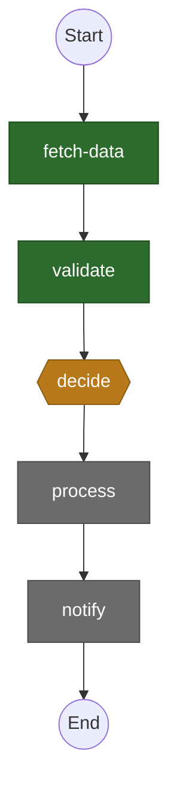

```mermaid
graph TD
    %% Workflow
    __start__(("Start"))
    fetch_data["fetch-data"]
    validate["validate"]
    decide{{"decide"}}
    process["process"]
    notify["notify"]
    __end__(("End"))
    __start__ --> fetch_data
    process --> notify
    fetch_data --> validate
    validate --> decide
    decide --> process
    notify --> __end__

    classDef completed fill:#2d6a2d,stroke:#1a4a1a,color:#fff
    classDef failed fill:#8b1a1a,stroke:#5c0e0e,color:#fff
    classDef running fill:#1a5276,stroke:#0e3a52,color:#fff
    classDef suspended fill:#b7791a,stroke:#8a5c14,color:#fff
    classDef pending fill:#6b6b6b,stroke:#4a4a4a,color:#fff
    classDef skipped fill:#4a4a4a,stroke:#333,color:#aaa,stroke-dasharray:5 5
    class fetch_data completed
    class validate completed
    class decide suspended
    class process pending
    class notify pending

```
