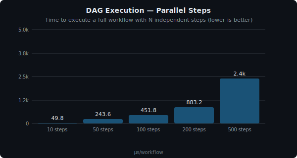
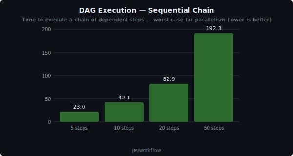
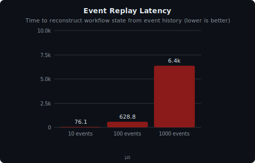

# OPCODE — Benchmarks

Auto-generated by `go run ./cmd/gen-benchmarks`. Do not edit manually.

> Numbers generated by running real Go benchmarks (`-count=3`) on your machine.
> Platform: `darwin/arm64` | Run `make benchmarks` to regenerate with fresh numbers.

## Units

| Symbol    | Name                      | Value                                    |
| --------- | ------------------------- | ---------------------------------------- |
| ns        | nanosecond                | 1/1,000,000,000 sec                      |
| µs        | microsecond               | 1/1,000,000 sec                          |
| ms        | millisecond               | 1/1,000 sec                              |
| B/op      | bytes per operation       | memory allocated per benchmark iteration |
| allocs/op | allocations per operation | heap allocations per iteration           |

**Reading the tables:** ↓ = lower is better, ↑ = higher is better.

## DAG Execution

Full workflow execution: DAG parse, level walk, WorkerPool dispatch, FSM transitions, event emission.



| Benchmark            | ns/op ↓ | allocs/op ↓ |  B/op ↓ |  Throughput ↑ |
| -------------------- | ------: | ----------: | ------: | ------------: |
| 10 steps (parallel)  |  49.8µs |         223 |  21.9KB | ~20.1k wf/sec |
| 50 steps (parallel)  | 243.6µs |         875 |  92.6KB |  ~4.1k wf/sec |
| 100 steps (parallel) | 451.8µs |        1681 | 181.8KB |  ~2.2k wf/sec |
| 200 steps (parallel) | 883.2µs |        3288 | 358.3KB |  ~1.1k wf/sec |
| 500 steps (parallel) |   2.4ms |        8098 |   1.0MB | ~416.7 wf/sec |

> **Takeaway:** A typical 10-step parallel workflow executes in under 50µs — fast enough to run ~21,000 workflows per second on a single core. Even at 500 steps, the engine completes a full workflow in ~2.4ms. Latency scales linearly with step count, and memory grows at ~2KB per step, keeping resource usage predictable.



| Benchmark             | ns/op ↓ | allocs/op ↓ | B/op ↓ |  Throughput ↑ |
| --------------------- | ------: | ----------: | -----: | ------------: |
| 5 steps (sequential)  |  23.0µs |         143 | 12.1KB | ~43.4k wf/sec |
| 10 steps (sequential) |  42.1µs |         278 | 22.8KB | ~23.7k wf/sec |
| 20 steps (sequential) |  82.9µs |         512 | 43.1KB | ~12.1k wf/sec |
| 50 steps (sequential) | 192.3µs |        1206 | 98.5KB |  ~5.2k wf/sec |

> **Takeaway:** Sequential is the worst case — each step waits for the previous one. Even so, a 50-step chain completes in ~200µs. The overhead per step (~4µs) is nearly identical to parallel execution, meaning the engine itself adds minimal scheduling cost.

| Benchmark                   | ns/op ↓ | allocs/op ↓ |  B/op ↓ |
| --------------------------- | ------: | ----------: | ------: |
| Diamond (5 steps, 3 levels) |  24.5µs |         139 |  12.1KB |
| 10 concurrent workflows     | 162.5µs |         880 |  86.7KB |
| 50 concurrent workflows     | 842.5µs |        4393 | 433.5KB |
| 100 concurrent workflows    |   1.7ms |        8768 | 862.0KB |

> **Takeaway:** The diamond pattern (fan-out → fan-in) shows that dependency resolution adds negligible overhead. Running 100 workflows simultaneously completes in ~1.7ms, demonstrating that the engine handles concurrent workloads efficiently through its shared WorkerPool.

---

## Event Store (libSQL)

Real embedded libSQL with WAL mode.


| Benchmark              | ns/op ↓ | allocs/op ↓ | B/op ↓ |      Throughput ↑ |
| ---------------------- | ------: | ----------: | -----: | ----------------: |
| Append (sequential)    |  61.7µs |          72 |  1.8KB | ~16.2k events/sec |
| Append (100 workflows) |  70.8µs |          70 |  1.8KB | ~14.1k events/sec |
| Append (10 writers)    |  67.3µs |          75 |  2.0KB | ~14.9k events/sec |
| Append (50 writers)    |  69.2µs |          74 |  2.0KB | ~14.5k events/sec |
| Append (100 writers)   |  71.3µs |          73 |  2.0KB | ~14.0k events/sec |

> **Takeaway:** The event store sustains ~15k appends/sec in sequential mode and only drops ~12% with 100 concurrent writers thanks to libSQL WAL mode. Since each step emits 2-3 events, this supports ~5,000-7,000 step completions per second — sufficient for most embedded use cases.



| Benchmark           | ns/op ↓ | allocs/op ↓ |  B/op ↓ |
| ------------------- | ------: | ----------: | ------: |
| Replay 10 events    |  76.1µs |        1730 |  65.1KB |
| Replay 100 events   | 628.8µs |       16763 | 622.2KB |
| Replay 1,000 events |   6.4ms |      168556 |   6.2MB |

> **Takeaway:** Replay reconstructs workflow state from the event log. 1,000 events replay in ~6.4ms, making crash recovery and workflow resume near-instant. Memory usage is proportional (~6KB per event), so even long-running workflows with thousands of events can be replayed efficiently.

---

## Worker Pool

Semaphore-based bounded goroutine pool.


| Benchmark               | ns/op ↓ | allocs/op ↓ |  B/op ↓ |     Throughput ↑ |
| ----------------------- | ------: | ----------: | ------: | ---------------: |
| Pool size 10            |   842ns |           1 |     48B |  ~1.2M tasks/sec |
| Pool size 50            |   886ns |           1 |     48B |  ~1.1M tasks/sec |
| Pool size 100           |   947ns |           1 |     48B |  ~1.1M tasks/sec |
| Pool size 500           |   932ns |           1 |     48B |  ~1.1M tasks/sec |
| Pool size 1000          |   787ns |           1 |     48B |  ~1.3M tasks/sec |
| Backpressure (10×1,000) | 817.2µs |        1000 |  48.0KB |  ~1.2k tasks/sec |
| Backpressure (10×5,000) |   4.0ms |        5000 | 240.0KB | ~248.7 tasks/sec |

> **Takeaway:** All pool sizes (10 to 1,000 workers) deliver over 1 million task dispatches per second — pool size has virtually no effect on CPU-bound throughput. The overhead per dispatch is ~0.85µs. Backpressure works correctly: a 10-worker pool queuing 5,000 tasks still completes, trading throughput for bounded resource usage.

---

## How to Run

```bash
# Regenerate all charts and this file
make benchmarks

# Or run directly (with configurable flags)
go run ./cmd/gen-benchmarks
go run ./cmd/gen-benchmarks -count=5 -timeout=300s

# Run benchmarks manually
go test ./internal/engine/ -bench . -benchmem
go test ./internal/store/ -bench . -benchmem
```

## Benchmark Files

| File                                     | Benchmarks                                                                                   |
| ---------------------------------------- | -------------------------------------------------------------------------------------------- |
| `internal/engine/worker_bench_test.go`   | Pool throughput (10-1000 workers), backpressure, I/O-bound                                   |
| `internal/engine/executor_bench_test.go` | Parallel DAG (10-500 steps), sequential (5-50 steps), diamond, concurrent workflows (10-100) |
| `internal/store/eventlog_bench_test.go`  | Append, concurrent writers (10-100), replay                                                  |

## Future Benchmarks

- Expression evaluation (CEL, GoJQ, Expr)
- `${{}}` interpolation with varying scope sizes
- Circuit breaker per-action overhead
- MCP JSON-RPC round-trip
- End-to-end with real HTTP actions
